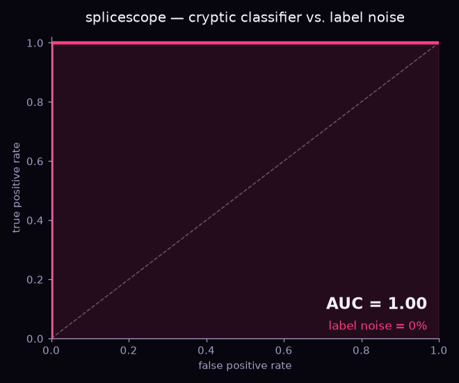
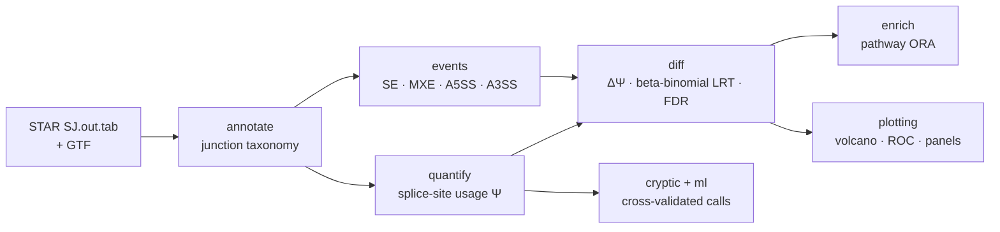

# splicescope

**Detect, quantify and characterize alternative & cryptic splicing events from splice junctions — with an honest, reproducible ML layer on top.**

[](https://github.com/elmasnuryilmaz/splicescope/actions/workflows/ci.yml)


[](https://splicescope-mirsdwuvkvwzvhrj2e2hgs.streamlit.app)
[](https://colab.research.google.com/github/elmasnuryilmaz/splicescope/blob/main/examples/tutorial.ipynb)

**▶ Try it live:** [splicescope on Streamlit](https://splicescope-mirsdwuvkvwzvhrj2e2hgs.streamlit.app) ·
**📓 Guided tutorial:** [examples/tutorial.ipynb](examples/tutorial.ipynb) (executed, with outputs)

Most of what we want to know about alternative and **cryptic** splicing is already
present in the splice junctions aligners such as STAR report. `splicescope` turns those
junctions plus a reference annotation into: a classification of every junction, a
model-free usage metric (Ψ), **event-level PSI** for cassette exons, mutually exclusive
exons and alternative 5′/3′ splice sites (SE / MXE / A5SS / A3SS), a differential-splicing
test between conditions, and a cross-validated classifier that prioritises genuine cryptic
events over noise.

Everything runs out of the box on a built-in synthetic dataset — **no downloads, no
private data** — which is also what the test suite and CI use.


*One reproducible command produces every panel above: junction classes, a ΔΨ volcano,
splicing events by type (SE / MXE / A5SS / A3SS), differential exon inclusion, what the
cryptic classifier keys on, and its cross-validated ROC.*

And the classifier degrades **gracefully** as labelling error grows — an honest robustness
check rather than a single lucky number:

<p align="center"></p>

---

## Why it exists

Cryptic-exon dysregulation (e.g. loss of TDP-43 in ALS/FTD) has made cryptic splicing a
front-line question in RNA biology. But novel junctions are dominated by technical noise,
and calling the real events usually means ad-hoc thresholds. `splicescope` replaces those
thresholds with (1) a transparent junction taxonomy, (2) a **calibrated statistical test**
on the read counts rather than on Ψ, and (3) a prediction of what each event does to the
protein.

A classifier over junction features is also included, evaluated with leakage-free
cross-validation and shipped with a model card — but held to the same standard as
everything else here. Measured against replication in an independent experiment it is
**worse than the statistical test** at ranking confidently reproducible events, because
its features describe whether a junction is plausible, not whether it changes between
conditions. Treat it as a noise filter, not as the way to find cryptic events; the numbers
are in [validation/README.md](validation/README.md).

## Install

```bash
git clone https://github.com/elmasnuryilmaz/splicescope.git
cd splicescope
python -m venv .venv && source .venv/bin/activate
pip install -e ".[dev]"          # add ",app" for the Streamlit dashboard
```

## Quickstart

```bash
# 1) write a synthetic, ground-truth dataset (STAR SJ.out.tab + GTF + groups.tsv)
splicescope simulate --outdir demo_data

# 2) run the whole pipeline: annotate -> quantify -> differential -> figures
splicescope run \
    --sj-dir demo_data/sj \
    --gtf    demo_data/annotation.gtf \
    --groups demo_data/groups.tsv \
    --outdir results
```

Or drive it from Python:

```python
from splicescope import annotate, quantify, diff, cryptic
from splicescope.ml import CrypticClassifier
from splicescope.simulate import simulate_dataset

ds = simulate_dataset(n_genes=20, n_per_group=6, label_noise=0.12, seed=11)
ann  = annotate.annotate_junctions(ds.observed, ds.known)   # classify junctions
psi  = quantify.compute_psi(ann)                            # splice-site usage Ψ
dpsi = diff.differential_splicing(psi, ds.groups)           # ΔΨ + beta-binomial LRT + BH

feats = cryptic.extract_features(psi, ds.known)             # per-junction features
clf   = CrypticClassifier().evaluate(feats)                 # stratified-CV ROC-AUC / AP
```

## How it works



| stage | module | what it does |
|-------|--------|--------------|
| **Ingest** | `io` | read STAR `SJ.out.tab`; derive known introns from a GTF |
| **Annotate** | `annotate` | label each junction: `annotated`, `novel_donor`, `novel_acceptor`, `novel_combination`, `cryptic` |
| **Quantify** | `quantify` | Ψ = fraction of a splice site's reads flowing through a junction (model-free) |
| **Events** | `events` | reconstruct SE / MXE / A5SS / A3SS events and compute rMATS-style percent-spliced-in |
| **Differential** | `diff` | ΔΨ between two conditions, beta-binomial likelihood-ratio test on read counts, Benjamini–Hochberg FDR (junction- or event-level) |
| **Features** | `cryptic` | intron length, read support, recurrence, motif, distance to known sites … |
| **Learn** | `ml` | RandomForest + StandardScaler, stratified-CV, permutation importance, model card |
| **Consequence** | `consequence` | reading frame, premature stop codon and NMD prediction per exon |
| **Enrich** | `enrich` | hypergeometric pathway over-representation (ORA) with BH-FDR, any GMT gene sets |
| **Visualize** | `plotting` | publication-quality panels (headless-safe) |

The synthetic generator (`simulate`) is biologically faithful: a cryptic exon produces a
`novel_acceptor` junction that shares the upstream *known* donor and a `novel_donor`
junction that shares the downstream *known* acceptor, up-regulated in one condition, on a
background of canonical introns and noise. An optional `label_noise` reflects imperfect
curation so the ML task is realistically hard rather than trivially separable.

> **Formal definitions** — the Ψ metric, the differential-splicing statistics, the
> classifier's leakage-free evaluation protocol and the simulation model are all
> specified in **[docs/METHODS.md](docs/METHODS.md)**.

## Scaling & exploring

- **`nextflow/`** — a DSL2 pipeline that runs the same steps across many samples on a
  cluster or in containers (`nextflow run nextflow/main.nf -profile test`).
- **`app/streamlit_app.py`** — an interactive dashboard to browse junction classes,
  the volcano and ranked cryptic candidates (`pip install -e ".[app]"` then
  `streamlit run app/streamlit_app.py`). Deploy-ready for Streamlit Community Cloud —
  point it at `app/streamlit_app.py`.

## Testing

```bash
pytest            # 12 tests: unit + property + an end-to-end CLI run
ruff check .      # lint
```

CI runs the suite and the linter on every push (see the badge above).

## The differential test

`splicescope` tests the **read counts** Ψ was computed from, not Ψ itself, and that choice
decides whether the tool finds anything on a real dataset.

A two-sided Mann–Whitney U on `n` replicates per group cannot return a p-value below
`2 / C(2n, n)` — **0.1 for a 3-vs-3 design**, and still `1.1e-5` at 10-vs-10. Clearing
Benjamini–Hochberg across ~10⁵ junctions needs the top hit near `1e-7`, so a rank test
reports nothing significant at any realistic replicate count, however large the effect.

Instead, inclusion counts are modelled as beta-binomial and the two groups are compared by
a likelihood-ratio test, with a shared dispersion estimated from df-corrected Pearson
residuals about each group's own mean. Null p-values are calibrated (nominal 0.05 →
observed 0.045–0.053 in simulation) and evidence now grows with coverage rather than only
with replicate count.

The rank test is still reachable as `test="ranksum"` for Ψ tables that carry no counts.
Formal definitions are in [docs/METHODS.md](docs/METHODS.md) §5.

## Protein consequence

Finding a cryptic exon says nothing about whether it matters. The same event can be
tolerated, shift the reading frame, or introduce a premature termination codon that sends
the transcript to nonsense-mediated decay — which is how TDP-43 cryptic exons deplete
proteins such as STMN2 and UNC13A.

```bash
splicescope consequence \
    --events results/events.tsv \
    --gtf    gencode.v47.annotation.gtf.gz \
    --genome GRCh38.primary_assembly.genome.fa \
    --out    results/consequence.tsv
```

Cassette exons are given as exon intervals; novel donors and acceptors are given as
junctions and resolved against the annotation, which matters because splice-site shifts
outnumber cassettes among reported cryptic events. The genome needs its `samtools faidx`
index next to it; nothing else is required. Each
exon is classified as `ptc_nmd`, `ptc_escape`, `frameshift`, `in_frame_insertion`,
`utr_insertion`, `non_coding_host` or `no_host_transcript`, alongside the inherited frame,
the PTC offset and its distance to the last exon-exon junction.

> Use the **full** GENCODE annotation, not `basic`. The reduced set is missing transcripts
> and leaves far more events without a host intron (43% vs 20% on the same 300 exons).

## Notes & limitations

The bundled data is **simulated** to keep the project self-contained and testable, so the
pipeline has also been run end-to-end on a real experiment — a human TDP-43 knockdown
(GSE245332, 3 vs 3) — where it recovers STMN2, HDGFL2, PFKP, ARHGAP32, KALRN, AGRN, ATG4B
and RAP1GAP among its significant events, and calls 4,699 differentially spliced events
against rMATS's 3,724 on the same BAMs. Numbers, misses and the BAM-to-junction step are
in [validation/README.md](validation/README.md).

The classifier is a separate matter: its model card is explicit that it should be
retrained on curated labels and validated on held-out genes before any real-data use.
Ψ here is splice-site *usage*, a deliberately model-free proxy; event-level PSI (cassette
exons, etc.) is a natural extension.

## Cite

If this project is useful, please cite it (see [`CITATION.cff`](CITATION.cff)):

> Yılmaz, E. (2026). *splicescope: detecting and characterizing cryptic splicing from
> splice junctions* (v0.1.0). https://github.com/elmasnuryilmaz/splicescope

## License

MIT © Elmasnur Yılmaz — see [LICENSE](LICENSE).
