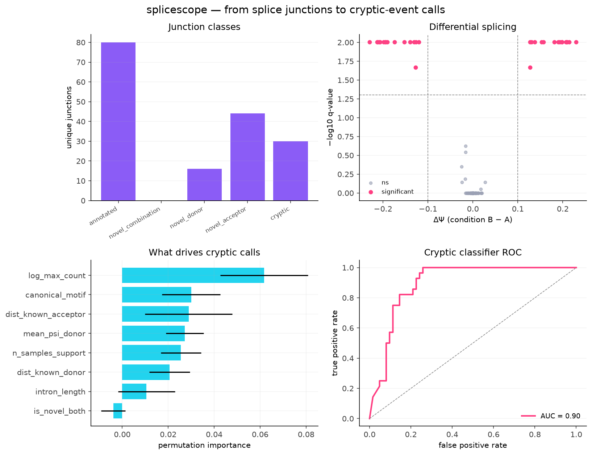

# splicescope

**Detect, quantify and characterize alternative & cryptic splicing events from splice junctions — with an honest, reproducible ML layer on top.**

[](https://github.com/elmasnuryilmaz/splicescope/actions/workflows/ci.yml)


Most of what we want to know about alternative and **cryptic** splicing is already
present in the splice junctions aligners such as STAR report. `splicescope` turns those
junctions plus a reference annotation into: a classification of every junction, a
model-free usage metric (Ψ), a differential-splicing test between conditions, and a
cross-validated classifier that prioritises genuine cryptic events over noise.

Everything runs out of the box on a built-in synthetic dataset — **no downloads, no
private data** — which is also what the test suite and CI use.



*One reproducible command produces all four panels above: junction classes, a ΔΨ volcano,
what the cryptic classifier keys on, and its cross-validated ROC.*

---

## Why it exists

Cryptic-exon dysregulation (e.g. loss of TDP-43 in ALS/FTD) has made cryptic splicing a
front-line question in RNA biology. But novel junctions are dominated by technical noise,
and calling the real events usually means ad-hoc thresholds. `splicescope` replaces those
thresholds with (1) a transparent junction taxonomy and (2) a classifier evaluated with
leakage-free cross-validation and shipped with a **model card**.

## Install

```bash
git clone https://github.com/elmasnuryilmaz/splicescope.git
cd splicescope
python -m venv .venv && source .venv/bin/activate
pip install -e ".[dev]"          # add ",app" for the Streamlit dashboard
```

## Quickstart

```bash
# 1) write a synthetic, ground-truth dataset (STAR SJ.out.tab + GTF + groups.tsv)
splicescope simulate --outdir demo_data

# 2) run the whole pipeline: annotate -> quantify -> differential -> figures
splicescope run \
    --sj-dir demo_data/sj \
    --gtf    demo_data/annotation.gtf \
    --groups demo_data/groups.tsv \
    --outdir results
```

Or drive it from Python:

```python
from splicescope import annotate, quantify, diff, cryptic
from splicescope.ml import CrypticClassifier
from splicescope.simulate import simulate_dataset

ds = simulate_dataset(n_genes=20, n_per_group=6, label_noise=0.12, seed=11)
ann  = annotate.annotate_junctions(ds.observed, ds.known)   # classify junctions
psi  = quantify.compute_psi(ann)                            # splice-site usage Ψ
dpsi = diff.differential_splicing(psi, ds.groups)           # ΔΨ + Mann–Whitney + BH-FDR

feats = cryptic.extract_features(psi, ds.known)             # per-junction features
clf   = CrypticClassifier().evaluate(feats)                 # stratified-CV ROC-AUC / AP
```

## How it works

| stage | module | what it does |
|-------|--------|--------------|
| **Ingest** | `io` | read STAR `SJ.out.tab`; derive known introns from a GTF |
| **Annotate** | `annotate` | label each junction: `annotated`, `novel_donor`, `novel_acceptor`, `novel_combination`, `cryptic` |
| **Quantify** | `quantify` | Ψ = fraction of a splice site's reads flowing through a junction (model-free) |
| **Differential** | `diff` | ΔΨ between two conditions, Mann–Whitney U, Benjamini–Hochberg FDR |
| **Features** | `cryptic` | intron length, read support, recurrence, motif, distance to known sites … |
| **Learn** | `ml` | RandomForest + StandardScaler, stratified-CV, permutation importance, model card |
| **Visualize** | `plotting` | publication-quality panels (headless-safe) |

The synthetic generator (`simulate`) is biologically faithful: a cryptic exon produces a
`novel_acceptor` junction that shares the upstream *known* donor and a `novel_donor`
junction that shares the downstream *known* acceptor, up-regulated in one condition, on a
background of canonical introns and noise. An optional `label_noise` reflects imperfect
curation so the ML task is realistically hard rather than trivially separable.

## Scaling & exploring

- **`nextflow/`** — a DSL2 pipeline that runs the same steps across many samples on a
  cluster or in containers (`nextflow run nextflow/main.nf -profile test`).
- **`app/streamlit_app.py`** — an interactive dashboard to browse junction classes,
  the volcano and ranked cryptic candidates (`streamlit run app/streamlit_app.py`).

## Testing

```bash
pytest            # 12 tests: unit + property + an end-to-end CLI run
ruff check .      # lint
```

CI runs the suite and the linter on every push (see the badge above).

## Notes & limitations

The bundled data is **simulated** to keep the project self-contained and testable. The
model card is explicit that the classifier should be retrained on curated labels and
validated on held-out genes before any real-data use. Ψ here is splice-site *usage*, a
deliberately model-free proxy; event-level PSI (cassette exons, etc.) is a natural
extension.

## License

MIT © Elmasnur Yılmaz — see [LICENSE](LICENSE).
