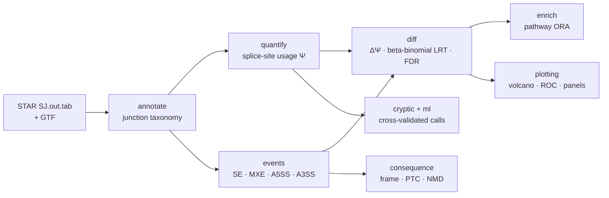
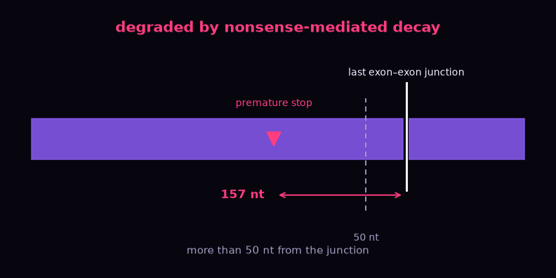

# splicescope

**Detect, quantify and characterize alternative & cryptic splicing events from splice junctions — with an honest, reproducible ML layer on top.**

[](https://doi.org/10.5281/zenodo.22287002)
[](https://github.com/elmasnuryilmaz/splicescope/actions/workflows/ci.yml)


[](https://splicescope.streamlit.app)
[](https://colab.research.google.com/github/elmasnuryilmaz/splicescope/blob/main/examples/tutorial.ipynb)

**▶ Try it live:** [splicescope on Streamlit](https://splicescope.streamlit.app) ·
**📓 Guided tutorial:** [examples/tutorial.ipynb](examples/tutorial.ipynb) (executed, with outputs)

Most of what we want to know about alternative and **cryptic** splicing is already
present in the splice junctions aligners such as STAR report. `splicescope` turns those
junctions plus a reference annotation into: a classification of every junction, a
model-free usage metric (Ψ), **event-level PSI** for cassette exons, mutually exclusive
exons and alternative 5′/3′ splice sites (SE / MXE / A5SS / A3SS), a differential-splicing
test between conditions, and a cross-validated classifier that prioritises genuine cryptic
events over noise.

Everything runs out of the box on a built-in synthetic dataset — **no downloads, no
private data** — which is also what the test suite and CI use.


*One reproducible command produces every panel above: junction classes, a ΔΨ volcano,
splicing events by type (SE / MXE / A5SS / A3SS), differential exon inclusion, **what
including those exons does to the protein** — a premature stop, and whether it is far
enough from the last junction to trigger nonsense-mediated decay — and the cryptic
classifier's cross-validated ROC.*

And the classifier degrades **gracefully** as labelling error grows — an honest robustness
check rather than a single lucky number:

<p align="center"></p>

---

## Why it exists

Cryptic-exon dysregulation (e.g. loss of TDP-43 in ALS/FTD) has made cryptic splicing a
front-line question in RNA biology. But novel junctions are dominated by technical noise,
and calling the real events usually means ad-hoc thresholds. `splicescope` replaces those
thresholds with (1) a transparent junction taxonomy, (2) a **calibrated statistical test**
on the read counts rather than on Ψ, and (3) a prediction of what each event does to the
protein.

A classifier over junction features is also included, evaluated with leakage-free
cross-validation and shipped with a model card — but held to the same standard as
everything else here. Measured against replication in an independent experiment it is
**worse than the statistical test** at ranking confidently reproducible events, because
its features describe whether a junction is plausible, not whether it changes between
conditions. Treat it as a noise filter, not as the way to find cryptic events; the numbers
are in [validation/README.md](validation/README.md).

## Install

```bash
git clone https://github.com/elmasnuryilmaz/splicescope.git
cd splicescope
python -m venv .venv && source .venv/bin/activate
pip install -e ".[dev]"          # add ",app" for the Streamlit dashboard
```

## Quickstart

```bash
# 1) write a synthetic, ground-truth dataset: STAR SJ.out.tab + GTF (with CDS)
#    + groups.tsv + an indexed genome whose genes carry real open reading frames,
#    plus truth.tsv listing the events injected, so recall can be measured
splicescope simulate --outdir demo_data

# 2) run the whole pipeline: annotate -> quantify -> events -> differential
#    -> protein consequence -> figures
splicescope run \
    --sj-dir demo_data/sj \
    --gtf    demo_data/annotation.gtf \
    --groups demo_data/groups.tsv \
    --genome demo_data/genome.fa \
    --outdir results
```

Drop `--genome` and everything except the consequence step still runs. Nothing is
downloaded: the simulated chromosome is built from sense codons and canonical `GT`/`AG`
intron ends, so a cryptic exon spliced into it genuinely shifts the frame and genuinely
does, or does not, hit a stop codon.

Or drive it from Python:

```python
from splicescope import annotate, quantify, diff, cryptic
from splicescope.ml import CrypticClassifier
from splicescope.simulate import simulate_dataset

ds = simulate_dataset(n_genes=20, n_per_group=6, label_noise=0.12, seed=11)
ann  = annotate.annotate_junctions(ds.observed, ds.known)   # classify junctions
psi  = quantify.compute_psi(ann)                            # splice-site usage Ψ
dpsi = diff.differential_splicing(psi, ds.groups)           # ΔΨ + beta-binomial LRT + BH

feats = cryptic.extract_features(psi, ds.known)             # per-junction features
clf     = CrypticClassifier()
metrics = clf.evaluate(feats)                               # stratified-CV ROC-AUC / AP
```

Or the whole of it, protein consequences included, in one call:

```python
from splicescope.demo import run_demo

result = run_demo(n_genes=20, cryptic_fraction=0.6)
result.consequences[["gene_name", "insert_length", "ptc_offset", "consequence_class"]]
```

## How it works



| stage | module | what it does |
|-------|--------|--------------|
| **Ingest** | `io` | read STAR `SJ.out.tab`; derive known introns from a GTF |
| **Annotate** | `annotate` | label each junction: `annotated`, `novel_donor`, `novel_acceptor`, `novel_combination`, `cryptic` |
| **Quantify** | `quantify` | Ψ = fraction of a splice site's reads flowing through a junction (model-free) |
| **Events** | `events` | reconstruct SE / MXE / A5SS / A3SS events and compute rMATS-style percent-spliced-in |
| **Differential** | `diff` | ΔΨ between two conditions, beta-binomial likelihood-ratio test on read counts, Benjamini–Hochberg FDR (junction- or event-level) |
| **Features** | `cryptic` | intron length, read support, recurrence, motif, distance to known sites … |
| **Learn** | `ml` | RandomForest + StandardScaler, stratified-CV, permutation importance, model card |
| **Consequence** | `consequence` | reading frame, premature stop codon and NMD prediction, for cassette exons and for splice-site shifts |
| **Enrich** | `enrich` | hypergeometric pathway over-representation (ORA) with BH-FDR, any GMT gene sets — matched by symbol or accession, versioned or not |
| **Visualize** | `plotting` | publication-quality panels (headless-safe) |

The synthetic generator (`simulate`) is biologically faithful: a cryptic exon produces a
`novel_acceptor` junction that shares the upstream *known* donor and a `novel_donor`
junction that shares the downstream *known* acceptor, up-regulated in one condition, on a
background of canonical introns and noise. An optional `label_noise` reflects imperfect
curation so the ML task is realistically hard rather than trivially separable. It also
writes the matching chromosome — coding exons drawn from the 61 sense codons, canonical
`GT`/`AG` intron ends, and the 5′UTR staggered per gene so the coding frame at an intron
boundary cycles through 0, 1 and 2 — which is what lets the consequence layer be tested
rather than only asserted.

> **Formal definitions** — the Ψ metric, the differential-splicing statistics, the
> classifier's leakage-free evaluation protocol and the simulation model are all
> specified in **[docs/METHODS.md](docs/METHODS.md)**.

## Scaling & exploring

- **`nextflow/`** — a DSL2 pipeline that runs the same steps across many samples on a
  cluster or in containers. `nextflow run nextflow/main.nf -profile test` is the
  self-contained demo; real data goes in as
  `--sj_dir … --gtf … --groups … [--genome …]`, each staged independently. CI runs all
  three paths on every push.
- **`app/streamlit_app.py`** — an interactive dashboard that answers one question end
  to end: a knockdown switches on junctions the annotation does not contain, so which of
  them are real and what do they do to the protein? It picks a cryptic cassette exon,
  shows its Ψ in every replicate, and says in words what including it does — *"the first
  premature stop appears 63 nucleotides in, 355 before the last exon-exon junction, more
  than the 50 the rule allows, so nonsense-mediated decay is predicted"* — beside the
  reason a rank test could not have called it. (`pip install -e ".[app]"` then
  `streamlit run app/streamlit_app.py`.) The analysis behind it is
  `splicescope.demo.run_demo`, which is also the shortest way to run the whole pipeline
  on synthetic data from Python; the page itself is presentation only, and CI renders it
  headlessly on every push.

## Testing

```bash
pytest            # 314 tests: unit + property-based + end-to-end CLI runs
ruff check .      # lint
pytest --cov=splicescope   # 97 % of statements; CI fails below 90 %
```

CI runs the suite and the linter on every push against Python 3.10-3.13, plus the
Nextflow pipeline on all three of its input paths and a headless render of the Streamlit
dashboard (see the badge above). A separate job installs the *oldest* dependency versions
`pyproject.toml` claims to support — pinned in `constraints-oldest.txt` — because a matrix
that always resolves to the newest of everything never checks that the declared floor is
real. It is: the suite passes on pandas 1.5.0 with numpy 1.23.5, and on pandas 3.

Fourteen of those are **property-based** (`hypothesis`): generators produce junction
tables, annotations and DNA, and the invariants have to hold whatever comes out — Ψ
exhausts its splice site, swapping the group labels flips ΔΨ and leaves the p-value
alone, a locus on another chromosome changes nothing, no event names a coordinate that
was never observed. One found a real defect on its first run, in the shape of an empty
result.

A green suite says the tests pass, not that they would fail if the code broke. So the
code is deliberately broken 85 ways and the suite has to notice:

```bash
python validation/mutation_survey.py
```

Each mutation is a mistake someone could plausibly make — an inclusive comparison where
it should be strict, a distance measured from the wrong end of a codon, a correction
applied to the wrong array — and the script reports any the suite fails to catch.
**29 of these passed the suite** as it stood when each was first tried: the
50-nucleotide rule this tool's NMD calls rest on, the last-exon exception, whether the
reported q-value was Benjamini-Hochberg-adjusted at all, seven of the eight features the
cryptic-junction classifier learns from, and three defects reachable only from the minus
strand. Three of the 29 are equivalent mutants that provably cannot change any answer,
and the script says which and why; the other 26 are now each pinned by a test. It also
runs weekly in CI.

## The differential test

`splicescope` tests the **read counts** Ψ was computed from, not Ψ itself, and that choice
decides whether the tool finds anything on a real dataset.

A two-sided Mann–Whitney U on `n` replicates per group cannot return a p-value below
`2 / C(2n, n)` — **0.1 for a 3-vs-3 design**, and still `1.1e-5` at 10-vs-10. Clearing
Benjamini–Hochberg across ~10⁵ junctions needs the top hit near `1e-7`, so a rank test
reports nothing significant at any realistic replicate count, however large the effect.

Instead, inclusion counts are modelled as beta-binomial and the two groups are compared by
a likelihood-ratio test, with a shared dispersion estimated from df-corrected Pearson
residuals about each group's own mean. Null p-values are calibrated (nominal 0.05 →
observed 0.045–0.053 in simulation) and evidence now grows with coverage rather than only
with replicate count.

The rank test is still reachable as `test="ranksum"` for Ψ tables that carry no counts.
Formal definitions are in [docs/METHODS.md](docs/METHODS.md) §5.

## Protein consequence

Finding a cryptic exon says nothing about whether it matters. The same event can be
tolerated, shift the reading frame, or introduce a premature termination codon that sends
the transcript to nonsense-mediated decay — which is how TDP-43 cryptic exons deplete
proteins such as STMN2 and UNC13A.

<p align="center"></p>

*The whole of the prediction is one threshold. Every verdict in that animation comes from
the function the pipeline uses, not from a drawing of the rule — regenerate it with
`python docs/make_nmd_rule_gif.py`.*

Passing `--genome` to `run` folds this into the pipeline, writing `consequence.tsv` for
cassette exons and `junction_consequence.tsv` for splice-site shifts. Candidates produced
elsewhere — an existing rMATS or LeafCutter run — go through the standalone command:

```bash
splicescope consequence \
    --events results/events.tsv \
    --gtf    gencode.v47.annotation.gtf.gz \
    --genome GRCh38.primary_assembly.genome.fa \
    --out    results/consequence.tsv
```

Cassette exons are given as exon intervals (`exon_start`/`exon_end`); novel donors and
acceptors are given as junctions (`start`/`end`) and resolved against the annotation into
the sequence they add to, or remove from, the neighbouring exon — which matters because
splice-site shifts outnumber cassettes among reported cryptic events. `--mode` picks
between the two and defaults to reading it off the columns present. The genome needs its
`samtools faidx` index next to it; nothing else is required. Each event is classified as
`ptc_nmd`, `ptc_escape`, `frameshift`, `exon_truncation`, `in_frame_insertion`,
`utr_insertion`, `non_coding_host` or `no_host_transcript`, alongside the inherited frame,
the PTC offset and its distance to the last exon-exon junction.

A junction already explained by a detected cassette or MXE event is *not* also reported as
a splice-site shift: on its own, a cassette inclusion junction reads as an exon extension
running to the end of the intron, which is the wrong interpretation of it. On the built-in
demo that exclusion removes 12 of 31 candidate junctions.

> Use the **full** GENCODE annotation, not `basic`. The reduced set is missing transcripts
> and leaves far more events without a host intron (43% vs 20% on the same 300 exons).

## Notes & limitations

The bundled data is **simulated** to keep the project self-contained and testable, so the
pipeline has also been run end-to-end on a real experiment — a human TDP-43 knockdown
(GSE245332, 3 vs 3) — where it recovers STMN2, HDGFL2, PFKP, ARHGAP32, KALRN, AGRN, ATG4B
and RAP1GAP among its significant events, and calls 4,699 differentially spliced events
against rMATS's 3,724 on the same BAMs. Numbers, misses and the BAM-to-junction step are
in [validation/README.md](validation/README.md).

The classifier is a separate matter: its model card is explicit that it should be
retrained on curated labels and validated on held-out genes before any real-data use.
Ψ here is splice-site *usage*, a deliberately model-free proxy; event-level PSI is
reported alongside it for SE, MXE, A5SS and A3SS. Intron retention is the event class
that is genuinely out of reach: it is measured from coverage *inside* the intron, which
splice junctions do not carry.

## Cite

If you use `splicescope` in your research, please cite it (see [`CITATION.cff`](CITATION.cff)):

> Yılmaz, E. (2026). *splicescope: detecting and characterizing cryptic splicing from
> splice junctions* (v0.9.1). Zenodo. https://doi.org/10.5281/zenodo.22287002

The DOI above is the **concept DOI**: it always resolves to the most recent release, so
it stays correct as the software evolves. To cite this exact version instead, use
[10.5281/zenodo.22287003](https://doi.org/10.5281/zenodo.22287003).

## License

MIT © Elmasnur Yılmaz — see [LICENSE](LICENSE).
